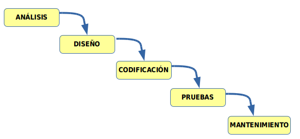

<!---
Ejemplos

<video class="stretch" controls><source src="http://clips.vorwaerts-gmbh.de/big_buck_bunny.mp4" type="video/mp4"></video>
<iframe width="560" height="315" src="https://www.youtube.com/embed/3RBq-WlL4cU" frameborder="0" allowfullscreen></iframe>

slide: data-background="#ff0000" 
element: class="fragment" data-fragment-index="1"
-->
## Entornos de desarrollo
---

<small> 2017-18 - IES Luis Vélez de Guevara - Écija - Spain </small>

## Elementos del desarrollo de software

## Índice
--- 
### Introducción
### Ciclo de vida del sofware
### Lenguajes de programación

<!--- Note: Nota a pie de página. -->

# Introducción

En esta Unidad aprenderemos a:

- Reconocer la relación de los programas con los componentes del sistema informático.
- Clasificar los lenguajes de programación.
- Diferenciar código fuente, objeto y ejecutable.
- Reconocer las características de la generación de código intermedio.
- Evaluar la funcionalidad ofrecida por las herramientas utilizadas en programación.
- Diferenciar el funcionamiento de los distintos tipos de traductores de lenguajes ante el código fuente de un programa.
- Identificar las fases de desarrollo de una aplicación informática.

## Tipos de software 

- De sistema (Sistema operativo, drivers)
- De aplicación (Suite ofimática, Navegador, Edición de imagen, ...)
- De desarrollo (Editores, compiladores, interpretes, ...)

## Relación Hardware-Software  

- Disco duro: almacena los archivos ejecutables y de datos.
- Memoria RAM: se cargan en ella el código binario de los archivos ejecutables y los archivos de datos necesarios.
- CPU: lee y ejecuta instrucciones almacenadas en memoria RAM, así como los datos necesarios.
- E/S: recoge nuevos datos desde la entrada, se muestran los resultados, se leen/guardan a disco, ...

## Códigos fuente, objeto y ejecutable

- Código fuente: archivo de texto legible escrito en un lenguaje de programación.
- Código objeto: archivo binario no ejecutable.
- Código ejecutable: archivo binario ejecutable. 

## Ejecución de un programa

Hay dos formas de ejecutar un programa:
- Compilación
- Interpretación

# Ciclo de vida del software

## Fases principales del desarrollo de software

- ANÁLISIS  
- DISEÑO
- CODIFICACIÓN
- PRUEBAS
- MANTENIMIENTO  
 

##  Resultado tras cada fase

- Ingeniería de sistemas: Especificación del sistema.
- ANÁLISIS: Especificación de requisitos del software.
- DISENO arquitectónico: Documento de arquitectura del software.
- DISENO detallado: Especificación de módulos y funciones.
- CODIFICACIÓN: Código fuente.
- PRUEBAS de unidades: Módulos utilizables.
- PRUEBAS de integración: Sistema utilizable.
- PRUEBAS del sistema: Sistema aceptado.
- Documentación: Documentación técnica y de usuario. 
- MANTENIMIENTO: Informes de errores y control de cambios.

## Modelos de desarrollo de software

- Modelo en cascada
- Modelo en cascada con realimentación
- Modelos evolutivos
  - Modelo de prototipos
  - Modelo en espiral
  - Metodologías ágiles

## Modelo en cascada

## Modelo en cascada con realimentación

## Modelos evolutivos

## Modelo de prototipos

## Modelo en espiral

## Metodologías ágiles

# Lenguajes de computadora

- Lenguajes de programación: C, C++, Java, Javascript, ...
- Lenguajes de otro tipo: HTML, XML, JSON, ...

## Lenguajes de programación - Tipos (I)

- Según la forma en la que operan:
  - __Declarativos__: Indicamos el resultado a obtener sin especificar los pasos.
  - __Imperativos__: Indicamos los pasos a seguir para obtener un resultado.

## Lenguajes de programación - Tipos (II)

Tipos de __lenguajes declarativos__:
  - Lógicos: Utilizan reglas. Ej: Prolog
  - Funcionales: Utilizan funciones. Ej: Lisp, Haskell
  - Algebraicos: Utilizan sentencias. Ej: SQL
  

## Lenguajes de programación - Tipos (III)

Tipos de __lenguajes imperativos__:
  - Estructurados: C
  - Orientados a objetos: Java
  - Multiparadigma: C++, Javascript

- Nota: Los lenguajes orientados a objetos son también lenguajes estructurados. 

## Lenguajes de programación

## Lenguajes de programación - Evolución

Código binario --> Ensamblador --> Lenguajes estructurados --> Lenguajes orientados a objetos

## Lenguajes de programación - Historia (I)

[Historia simplificada](http://rigaux.org/language-study/diagram-light.png)

[Historia detallada](http://rigaux.org/language-study/diagram.png)

