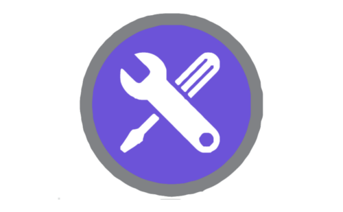

<!---
Ejemplos

<video class="stretch" controls><source src="http://clips.vorwaerts-gmbh.de/big_buck_bunny.mp4" type="video/mp4"></video>
<iframe width="560" height="315" src="https://www.youtube.com/embed/3RBq-WlL4cU" frameborder="0" allowfullscreen></iframe>

slide: data-background="#ff0000" 
element: class="fragment" data-fragment-index="1"
-->
## Entornos de desarrollo
---

<small> 2017-18 - IES Luis Vélez de Guevara - Écija - Spain </small>

## Entornos integrados de desarrollo

## Índice
--- 
### Introducción
### Conceptos y herramientas básicas
### Entornos integrados de desarrollo (IDE)

<!--- Note: Nota a pie de página. -->

# Introducción

En esta Unidad aprenderemos a:

- Instalar entornos de desarrollo, propietarios y libres.
- Añadir y eliminar módulos en el entorno de desarrollo.
- Personalizar y automatizar el entorno de desarrollo.
- Configurar el sistema de actualización del entorno de desarrollo.
- Generar ejecutables a partir de código fuente.
- Identificar las características comunes y específicas de diversos entornos de desarrollo.
- Identificar las funciones más usuales de las herramientas CASE.

### Conceptos y herramientas básicas

#### Conceptos

- Codigo fuente
- Codigo intermedio u objeto
- Codigo binario
- Bibliotecas (librerías)
- Compilar
- Enlazar (Link)
- Interpretar

### Herramientas básicas

- Editor de texto: permite escribir código fuente
- Compilador: genera código objeto a partir del código fuente
- Enlazador: agrupa varios archivos objeto en uno binario
- Interprete: lee código fuente y genera código binario para su ejecución
- Bibliotecas: conjunto de archivos objeto que extienden la funcionalidad del lenguaje

#### Bibliotecas (o librerías) (I)

- __Biblioteca estándar__ del lenguaje
  - Entrada y salida por terminal
  - Manejo de archivos
  - Funciones matemáticas
  - Interfaz gráfica (en algunos lenguajes, p. ej. Java)
- __Bibliotecas adicionales__
  - Bases de datos
  - Gráficos
  - Red
  - etc

#### Bibliotecas (o librerías) (II)

- Cada biblioteca está compuesta por varios archivos objeto
- Las bibliotecas modernas son dínamicas (.DLL o .so)
- También existe una versión estática (.LIB o .a)
  - es poco usada actualmente

#### Bibliotecas (o librerías) (III)

- Una biblioteca se compone de 2 partes:
  - Especificación (ofrece una API)
  - Implementación 

- API = Interfaz de Programación de Aplicaciones

#### Automatización 

Construir (Build) = Compilar + Enlazar

### Entornos integrados de desarrollo (IDE)

- Para C++:
  - DevC++
  - Microsoft Visual Studio
  - QtCreator
- Para Java:
  - Netbeans
  - Eclipse
  - IntelJ IDEA
  - Oracle JDeveloper

 
