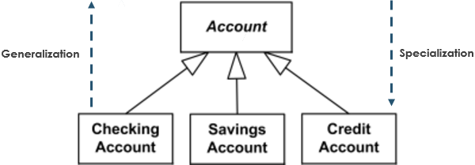

<!---
Ejemplos

<video class="stretch" controls><source src="http://clips.vorwaerts-gmbh.de/big_buck_bunny.mp4" type="video/mp4"></video>
<iframe width="560" height="315" src="https://www.youtube.com/embed/3RBq-WlL4cU" frameborder="0" allowfullscreen></iframe>

slide: data-background="#ff0000" 
element: class="fragment" data-fragment-index="1"
-->
## Entornos de desarrollo
---

<small> 2017-18 - IES Luis Vélez de Guevara - Écija - Spain </small>

## Elaboración de diagramas de clases

## Índice
--- 
### Introducción
### UML
### Diagramas de clases
### Software

<!--- Note: Nota a pie de página. -->

## Introducción

En esta Unidad aprenderemos a:

- Identificar las herramientas para la elaboración de diagramas de clases.
- Interpretar el significado de diagramas de clases.
- Generar código a partir de un diagrama de clases.
- Generar un diagrama de clases mediante ingeniería inversa.

## UML

**Lenguaje de modelado unificado**

- Es un lenguaje visual de propósito general para representar **modelos**.
- Pretende proporcionar una forma estándar de representar el diseño de un sistema.
- Dispone de numerosos tipos de diagramas.
- Cada tipo de diagrama muestra un aspecto diferente del modelo.

###  UML: Tipos de diagramas (I)

- **diagramas de estructura** (aspecto estático)
- **diagramas de comportamiento** (aspecto dinámico)

###  UML: Tipos de diagramas (II)

## Diagramas de clases

### Clases

### Objetos

### Interfaces

### Relaciones

- Asociación
    - Agregación
    - Composición
- Dependencia
- Generalización
- Realización

#### Asociación

#### Agregación

#### Composición

#### Dependencia

#### Generalización (herencia)

#### Realización (implementación de interfaces)

### Ejemplos

#### Karts

#### Videojuego

#### Colegio

#### Zoo

## UML: Software

- Enterprise Architect
- Visual Paradigm
- Microsoft Visio
- Dia, ArgoUML, Umbrello
- Plugins para Netbeans (**easyUML**, plantUML)
- Plugins para Eclipse (...)
- Plugins para IntellJ Idea (...)
- [Lista exhaustiva](https://en.wikipedia.org/wiki/List_of_Unified_Modeling_Language_tools)
