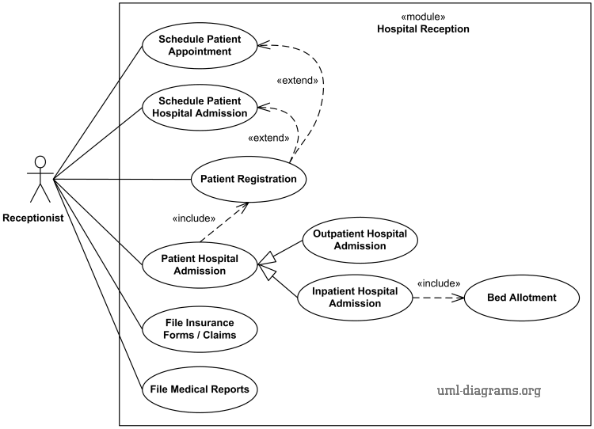
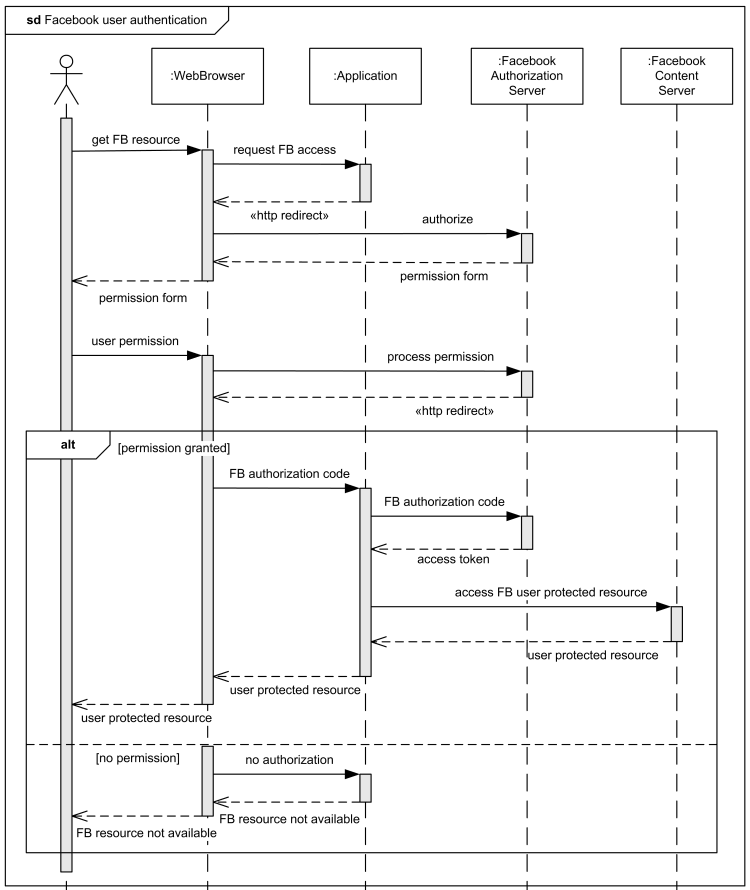
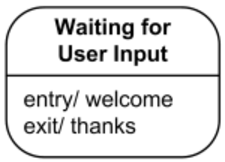
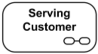
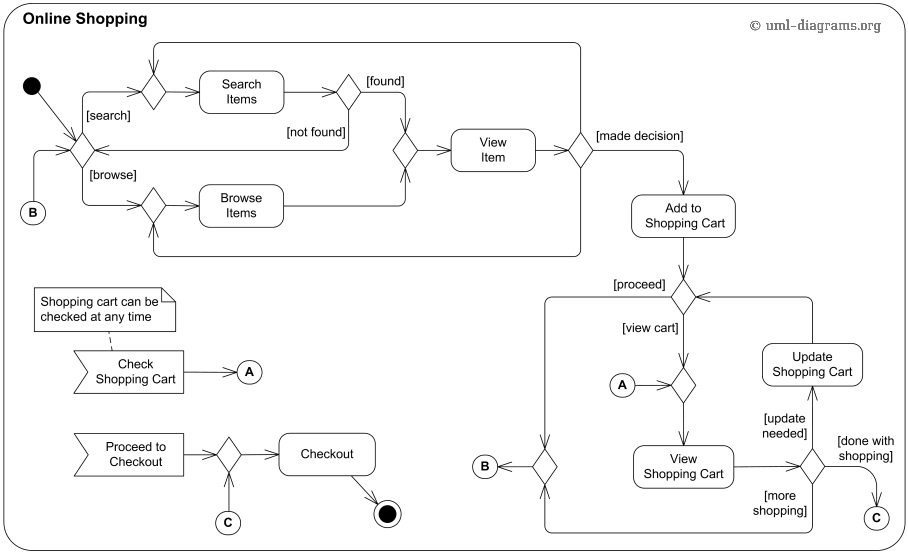
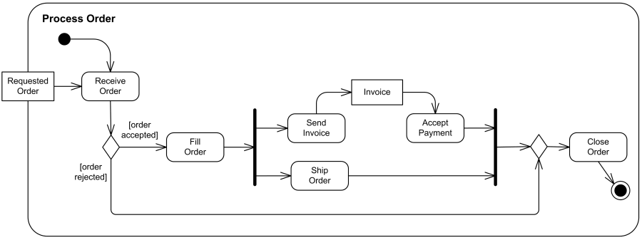
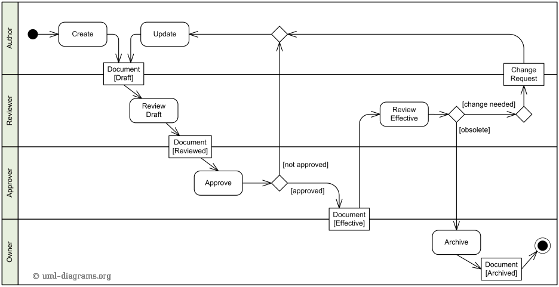

<!---
Ejemplos

<video class="stretch" controls><source src="http://clips.vorwaerts-gmbh.de/big_buck_bunny.mp4" type="video/mp4"></video>
<iframe width="560" height="315" src="https://www.youtube.com/embed/3RBq-WlL4cU" frameborder="0" allowfullscreen></iframe>

slide: data-background="#ff0000" 
element: class="fragment" data-fragment-index="1"
-->
## Entornos de desarrollo
---

<small> 2017-18 - IES Luis Vélez de Guevara - Écija - Spain </small>

## Elaboración de diagramas de comportamiento

## Índice
--- 
### Introducción
### Diagramas de casos de uso
### Diagramas de secuencia
### Diagramas de estados
### Diagramas de actividades
### Referencias
<!--- Note: Nota a pie de página. -->

## Introducción

En esta Unidad aprenderemos a:

- Identificar los distintos tipos de **diagramas de comportamiento**.
- Reconocer el significado de los diagramas de casos de uso.
- Elaborar e interpretar diagramas de interacción sencillos.
- Interpretar y plantear diagramas de estados.
- Elaborar e interpretar el significado de diagramas de actividades.

### UML: Diagramas de comportamiento

Los más utilizados son:

- Diagramas de casos de uso
- Diagramas de secuencia (es un diagrama de interacción)
- Diagramas de estados
- Diagramas de actividades

## Diagramas de casos de uso

### Elementos

- Actor
- Caso de uso
- Relaciones

### Ejemplo 1

### Ejemplo 1 (continuación)

### Ejemplo 2

## Diagramas de secuencia

### Ejemplo 1

### Ejemplo 2

## Diagramas de estados

#### Pseudoestado inicial

#### Estado final

### Estados simples

### Estados compuestos

### Ejemplo 1

### Ejemplo 2

## Diagramas de actividades

### Ejemplo 1

### Ejemplo 2

### Ejemplo 3

## Referencias

- [Diagramas UML de ejemplo](https://uml-diagrams.org)
- [OMG.org, donde bajar las especificaciones de UML](https://www.omg.org/spec/UML/)
- [UML.org](http://uml.org)