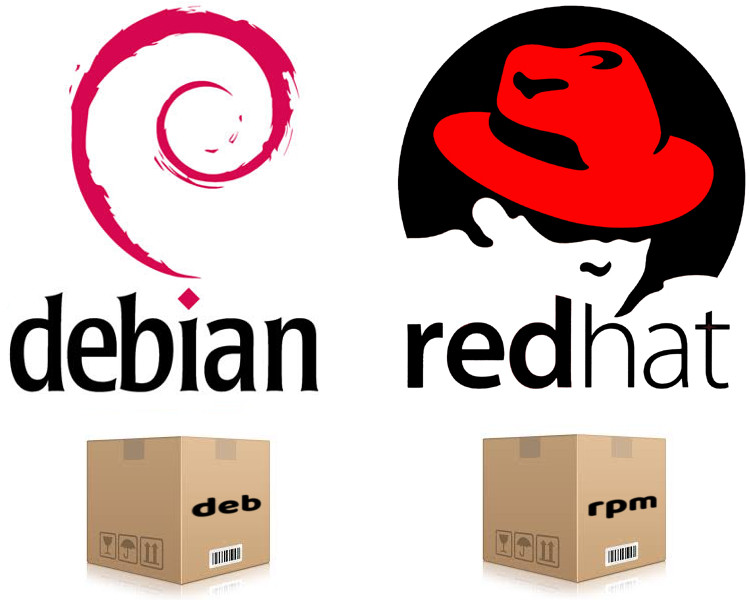
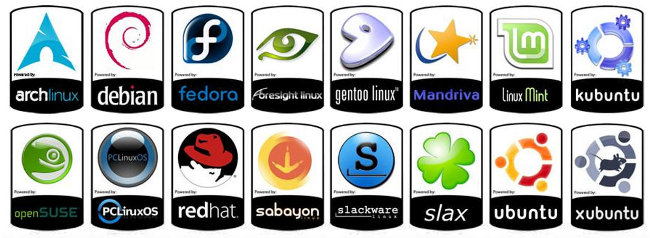
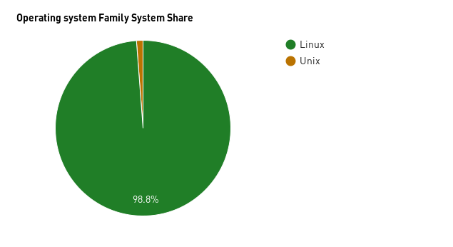
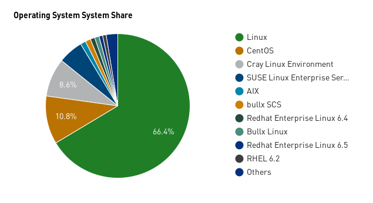
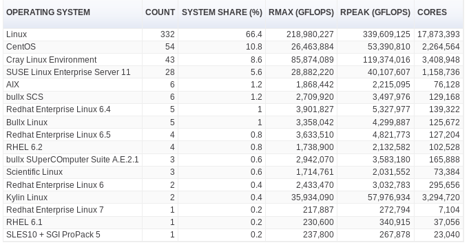
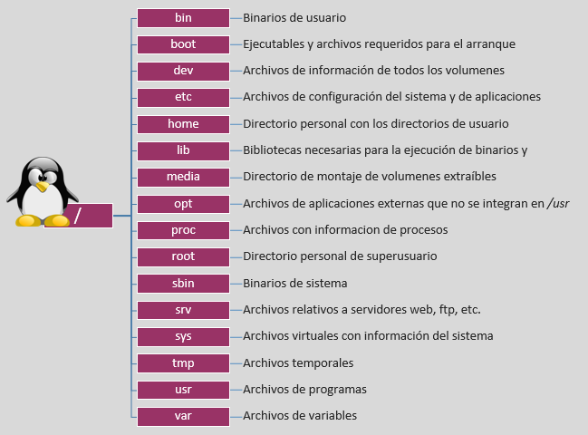
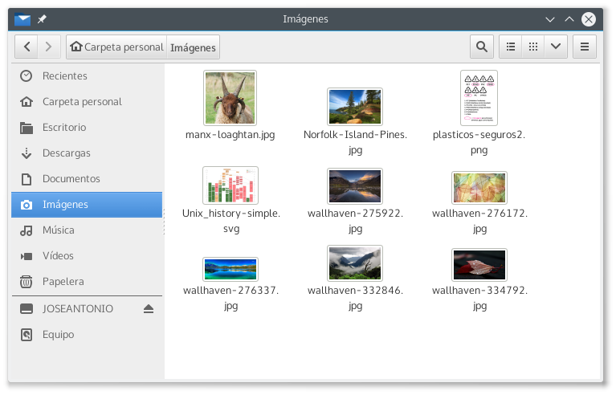
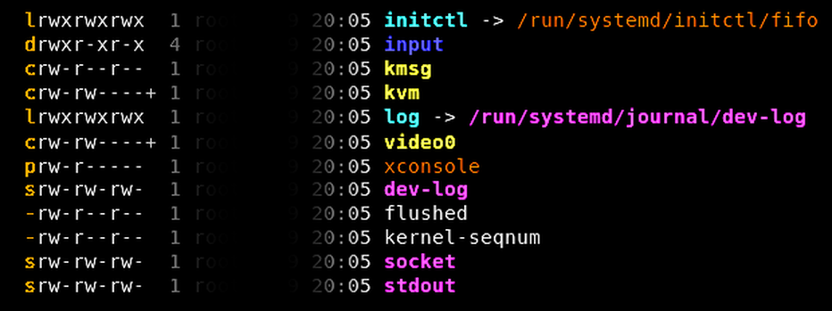
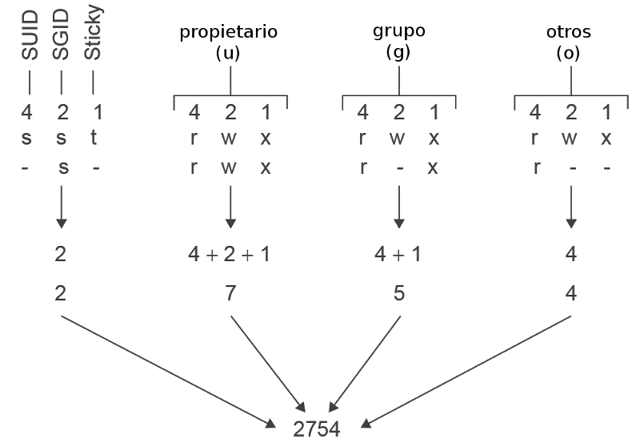

<!---
Ejemplos

<video class="stretch" controls><source src="http://clips.vorwaerts-gmbh.de/big_buck_bunny.mp4" type="video/mp4"></video>
<iframe width="560" height="315" src="https://www.youtube.com/embed/3RBq-WlL4cU" frameborder="0" allowfullscreen></iframe>

slide: data-background="#ff0000" 
element: class="fragment" data-fragment-index="1"
-->

# GNU/Linux
---

### Administración de equipos
<small> 2016 - IES Luis Vélez de Guevara - Écija - Spain </small>


# Licencia

[](http://creativecommons.org/licenses/by-sa/4.0/)

La versión más actualizada de este documento se encuentra en

[jamj2000.github.io](http://jamj2000.github.io/gnulinux/1/diapositivas)


# Índice
--- 
## Introducción 
## Sistemas de archivos
## Interfaces de usuario
## Comandos

<!--- Note: Nota a pie de página. -->


# Intro
---
## Proyecto GNU 
## Kernel Linux
## Licencias de software
## Distribuciones


### Proyecto GNU
- Sistema operativo de tipo Unix.
- Acrónimo recursivo de "GNU's Not Unix"
- Iniciado en 1983 por Richard Stallman.
- Auspiciado por la Free Software Foundation.
- Propio núcleo llamado GNU Hurd.
- Elaboración de la licencia GPL (General Public License)


### Proyecto GNU


Richard Stallman


### Núcleo Linux
- Concebido por Linus Torvalds en 1991.
- Desarrollado por colaboradores de todo el mundo.
- Distribuido bajo licencia GPL (de GNU Public License).
- Uno de los núcleos más ampliamente portados.
- Escrito en el lenguaje de programación C.


### Núcleo Linux


Linus Torvalds


### Licencia de software

- contrato entre: 
  - __licenciante__ (autor/titular de los derechos de explotación/distribuidor) y 
  - __licenciatario__ (usuario consumidor /usuario profesional o empresa) 


### Licencia de software

- con cláusulas acerca de los términos y condiciones establecidas:
  - cesión de derechos al usuario final sobre una o varias copias del programa informático
  - límites en la responsabilidad por fallos por parte del licenciante
  - el plazo de cesión de los derechos
  - el ámbito geográfico de validez del contrato
  - otros restricciones:
     - no cesión del programa a terceros
     - no reinstalación del programa en equipos distintos al que se instaló originalmente


### Software libre

- Libertad 0: __Usar__ el programa, con cualquier propósito. <!-- .element: class="fragment" data-fragment-index="1" -->
- Libertad 1: __Estudiar__ cómo funciona el programa y modificarlo, adaptándolo a las propias necesidades. <!-- .element: class="fragment" data-fragment-index="2" -->
- Libertad 2: __Distribuir__ copias del programa, con lo cual se puede ayudar a otros usuarios. <!-- .element: class="fragment" data-fragment-index="3" -->
- Libertad 3: __Mejorar__ el programa y hacer públicas esas mejoras a los demás, de modo que toda la comunidad se beneficie. <!-- .element: class="fragment" data-fragment-index="4" -->

Las libertades 1 y 3 requieren __acceso al código fuente__ porque estudiar y modificar software sin su código fuente es muy poco viable. <!-- .element: class="fragment" data-fragment-index="5" -->

[Software libre](https://es.wikipedia.org/wiki/Software_libre)


 
### Copyleft

- Utiliza la ley de copyright para lograr lo opuesto de su propósito usual: 
  - en lugar de imponer restricciones al usuario, le otorga derechos
  - __garantiza que los derechos no puedan ser posteriormente quitados o restringidos__


### Tipos de licencias
- Licencias propietarias 
 - EULA (End User License Agreement)
- Licencias libres
 - __GPL__, Apache, Mozilla, BSD, MIT, ... - __Código fuente__
 - LGPL (Lesser GPL) - __Bibliotecas o librerías__
 - AGPL (Affero GPL) - __Software de servicios de red__
 - FDL, __CC__ - __Documentación__
- Dominio público

[Listado de licencias](http://www.gnu.org/licenses/license-list.es.html)


### Distribuciones
Dos grandes ramas
- Debian
- RedHat


### Paquetes




### Distribuciones

[Evolución](http://futurist.se/gldt/wp-content/uploads/12.10/gldt1210.svg)


### Distribuciones



[distrowatch.com](http://distrowatch.com)


### Linux y los supercomputadores
[top500.org](http://top500.org)


<small>Estadísticas de Noviembre 2015</small>


### Familia de S.O. de los supercomputadores
[top500.org](http://top500.org)



<small>Estadísticas de Noviembre 2015</small>


### Familia de S.O. de los supercomputadores
[top500.org](http://top500.org)


<small>Estadísticas de Noviembre 2015</small>


### S.O. de los supercomputadores
[top500.org](http://top500.org)



<small>Estadísticas de Noviembre 2015</small>


### S.O. de los supercomputadores
[top500.org](http://top500.org)



<small>Estadísticas de Noviembre 2015</small>


### Instalación de GNU/Linux
#### Instaladores gráficos
- Existen muchos
- Los más conocidos:
  - __Anaconda__ (RedHat, Fedora, ...)
  - __Ubiquity__ (Ubuntu)
  - __Debian Installer__ (Debian)
  - __Calamares__ (Manjaro, KaOS, Netrunner, ...)
  - ...


### Instalación de GNU/Linux
#### Pasos importantes

- Creación de usuario
- Particionado (e instalación de GRUB)


# Sistemas de archivos
---
## Formatos 
## Árbol de directorios


### Formatos
- ext2, ext3, __ext4__  <!-- .element: class="fragment" data-fragment-index="1" -->
- __swap__              <!-- .element: class="fragment" data-fragment-index="2" -->
- reiser, btrfs, xfs    <!-- .element: class="fragment" data-fragment-index="3" -->
- vfat, exfat, ntfs     <!-- .element: class="fragment" data-fragment-index="4" -->
- iso9660, udf          <!-- .element: class="fragment" data-fragment-index="5" -->
- nfs, cifs, smbfs      <!-- .element: class="fragment" data-fragment-index="6" -->
- ... y muchos otros    <!-- .element: class="fragment" data-fragment-index="7" -->


### Partición de intercambio

- Usada para dar soporte de memoria virtual.
- Mayor seguridad que un archivo de intercambio.
- Tamaño mínimo recomendado:
  - RAM < 4GB:  __1 o 2GB swap__
  - RAM > 4GB:  __2GB swap__
  - En sistemas con __hibernación__ el tamaño debe ser al menos __igual a la RAM__ 


### Ejemplo de particionado


- __NOTA__: En sistemas UEFI es necesaria una pequeña partición tipo EFI formateada en FAT32.


### Herramientas de particionado
#### Interfaz gráfica
```
gparted

partitionmanager
```
<hr>
#### Interfaz de texto
```
fdisk

gdisk (GPT)
```


### Tabla de particiones
#### __MBR__ (Master Boot Record)
- __BIOS tradicional__
- __Máximo 4 particiones primarias__
- Una de ellas puede cambiarse a __extendida__
- Dentro de la partición extendida pueden crearse muchas __lógicas__
  
<hr>
#### __GPT__ (GUID Partition Table)
- __BIOS UEFI__
- __Máximo 128 particiones__
- No existen distintos tipos de particiones, todas son iguales


### Dispositivos de bloques
```sh
/dev/sda      # Primer disco duro
/dev/sda1     # Primera partición del primer disco duro
/dev/sda2     # Segunda partición del primer disco duro
...
/dev/sdb      # Segundo disco duro o dispositivo extraible
/dev/sdb1     # Primera partición del segundo disco duro
/dev/sdb2     # Segunda partición del segundo disco duro
...
/dev/sdc      # Tercer disco duro o dispositivo extraible
/dev/sdc1     # Primera partición del tercer disco duro
/dev/sdc2     # Segunda partición del tercer disco duro
...
/dev/sr0      # Primera unidad de CD/DVD
/dev/sr1      # Segunda unidad de CD/DVD
...
```


### Formatear particiones
- Para formatear una partición, ésta debe estar sin uso y desmontada.
- Todos los datos se perderán.
- Se utiliza el comando __`mkfs`__ (MaKe FileSystem).
- Por ejemplo, para formatear la partición séptima con distintos formatos.
```
mkfs.ext3   /dev/sda7
mkfs.ext4   /dev/sda7
mkfs.vfat   /dev/sda7
mkfs.ntfs   /dev/sda7
mkntfs      /dev/sda7 
```


### Comprobar particiones
- Para comprobar una partición es aconsejable que esté sin uso y desmontada.
- Se utiliza el comando __`fsck`__ (FileSystem ChecK).
- Por ejemplo, para comprobar la partición séptima en distintos formatos.
```
fsck.ext4   /dev/sda7
fsck.ext4   /dev/sda7
fsck.vfat   /dev/sda7
fsck.ntfs   /dev/sda7
ntfsck      /dev/sda7
```


### Árbol de directorios


### Árbol de directorios




### Directorios (I)

Directorio | Contenido
-----------|-----------------------------------------------
/bin       | binarios importantes
/sbin      | binarios importantes del sistema
__/root__  | archivos personales del usuario root (superusuario)
__/home__  | directorios personales para cada uno de los usuarios
__/media__ | particiones montadas automáticamente para medios extraíbles
/mnt       | particiones montadas manualmente


### Directorios (II)

Directorio | Contenido
-----------|-----------------------------------------------
__/usr__   | aplicaciones del sistema
/opt       | aplicaciones opcionales (de terceros)
/srv       | archivos que se sirven a otros sistemas
__/var__   | archivos variables: logs, cache, www, ...
__/tmp__   | archivos temporales
/lost+found| archivos recuperados


### Directorios (III)

Directorio | Contenido
-----------|-----------------------------------------------
__/boot__  | archivos de configuración del arranque
__/etc__   | archivos de configuración del sistema
/dev       | archivos especiales de dispositivo
/lib       | librerías del sistema
/sys       | información del sistema
/proc      | información de los procesos en ejecución
/run       | archivos con información en tiempo de ejecución


### Listado en árbol
```sh
tree
tree  directorio
tree  directorio  |  less
```


# Interfaces
---
## De texto
## Gráficas


## Interfaces de texto


### Tipos

- Terminales virtuales clásicos (__tty__) <!-- .element: class="fragment" data-fragment-index="1" -->
- Pseudoterminales              (__pts__) <!-- .element: class="fragment" data-fragment-index="2" -->


### Terminales virtuales clásicos 
- Más antiguos
- Normalmente 6 terminales disponibles
- Denominados __tty1, tty2, tty3, tty4, tty5 y tty6__
- Acceso mediante Ctrl+Alt+F1, ... , Ctrl+Alt+F6
- Ctrl+Alt+F7 es el entorno gráfico


### Pseudoterminales
- Más modernos
- Pueden crearse muchos pseudoterminales
- Denominados __pts/0, pts/1, pts/2, ...__
- Acceso desde aplicación gráfica o red


### Ctrl+Shift+C  
Para copiar
<hr>
### Ctrl+Shift+V 
Para pegar


### Sesiones de terminal abiertas
¿Quién está en el sistema y en qué terminales?
```sh
who
```
 o también
```sh
w
```
¿En qué terminal estoy?
```sh
tty
```


## Interfaces gráficas


### Componentes

Componente          | GNOME      |  KDE
--------------------|------------|----------
Servidor gráfico    | X-Window   | X-Window
Gestor de sesiones  | GDM        | SDDM
Gestor de ventanas  | Mutter     | Kwin
Escritorio          | Gnome shell| Plasma 


### Escritorios
- Muchisimos escritorios:
 - GNOME
 - KDE
 - Unity
 - XFCE
 - LXDE
 - Cinnamon
 - MATE
 - Enlightenment
 - ...y alguno más


### Aplicaciones gráficas
 
Aplicación          | GNOME     | KDE
--------------------|-----------|---------
Explorador archivos |nautilus   | dolphin
Editor de texto     |gedit      | kate
Compresor archivos  |file roller| ark
Grabador CD/DVD     |brasero    | k3b
Visor PDF           |evince     | okular
Visor imágenes      |eog        | gwenview
Reproductor música  |gnome music| amarok
Reproductor vídeo   |totem      | dragon player


### Aplicaciones gráficas
- __Se pueden instalar aplicaciones de un escritorio en otro tipo de escritorio__. Ejemplo: nautilus en KDE



### Aplicaciones gráficas
- Existen muchas aplicaciones comunes (incluso para Windows)

Aplicación          | Nombre
--------------------|--------------------
Navegador web       | firefox
Suite ofimática     | libreoffice
Editor de imágenes  | gimp
Reproductor de vídeo| vlc
Virtualización      | virtualbox


### Combinaciones de teclas

Combinación                | Operación
---------------------------|--------------------
__Alt+F2__                 | Ejecutar aplicación
__Alt+F4__                 | Cerrar ventana
__Alt+Tab__                | Cambiar entre ventanas
__Ctrl+C, Ctrl+X, Ctrl+V__ | Copiar, Cortar, Pegar
__Ctrl+Alt+Esc__           | Matar ventana bloqueda (sólo KDE)


# Comandos (I)
---
## Conceptos


### Introducción
- Innumerables comandos     <!-- .element: class="fragment" data-fragment-index="1" -->
- ... para innumerables usos<!-- .element: class="fragment" data-fragment-index="2" -->
- Muchos comandos externos  <!-- .element: class="fragment" data-fragment-index="3" -->
- ... y pocos comandos internos<!-- .element: class="fragment" data-fragment-index="4" -->


### Comandos externos vs internos
- Comandos externos principalmente en: 
 - /bin
 - /usr/bin
 - /sbin
 - /usr/sbin
- Comandos internos  ¿Dónde?<!-- .element: class="fragment" data-fragment-index="1" -->
 - Dentro de /bin/bash <!-- .element: class="fragment" data-fragment-index="2" -->


### Algunos comandos externos 
```sh
ls 
cp
mkdir
touch
nano
less
mv
rm
man
clear
reset
adduser
deluser
```


### Algunos comandos internos
```sh
cd 
pwd
help
echo
jobs
bg
fg
kill
history
exit
logout
type
```


### Comprobar si un comando es interno o externo
```sh
type  comando
```
Ejemplos
```sh
type  ls
type  cd 
type  type
type  man 
type  echo
type  mkdir
type  rm
```


### Synopsis
```
comando   [opciones]   [argumentos]
```
#### Errores de concepto frecuentes
- Poner un nombre de archivo (texto, imagen, documento u otro) en lugar del comando
- Poner un nombre de directorio en lugar del comando


### Opciones y argumentos
Opciones cortas
```
-h  -a  -l  ...
```
... se pueden agrupar sin un orden
```
-ahl
```
Opciones largas
```
--help  --verbose ...
```
Argumentos
```
nombre_archivo  nombre_directorio  subcomando  ...
```


### Ayuda
Para comandos externos, __páginas de manual__
```sh
man
man  comando-externo
```
Para comandos internos, __páginas de ayuda__
```sh
help
help  comando-interno
```


### Uso de ayuda
Ejemplos
```sh
man  ls
man  adduser
man  shutdown
man  date
man  man 
```
```sh
help  cd
help  echo
help  kill
help  history
help  help 
```


# Comandos (II)
---
## Comandos básicos


### Identidad 
¿Quién soy?
```sh
whoami
```
Más información
```sh
id
id   nombre_usuario
```
¿Dónde estoy?
```sh
pwd
```


### Datos del S.O.
Version del nucleo (kernel) Linux
```sh
uname  -r
```
Sistema de 32 o 64 bits
```sh
uname  -m
```
Mas informacion
```sh
uname  -a
```
Distro
```sh
cat  /etc/issue
```


### Fecha, hora, calendario
Fecha y hora
```sh
date
```
Calendario de mes actual
```sh
cal
```
Calendario 2016
```sh
cal  2016
```


### Desplazarnos por el sistema 
```sh
pwd
cd  directorio_destino
```


### Rutas
- __Ruta absoluta__
 - Se inicia en el directorio raíz
 - __SIEMPRE comienza por /__
 - Es independiente del directorio actual
- __Ruta relativa__
 - Se inicia en el directorio actual
 - __NUNCA comienza por /__
 - Depende del directorio actual


### Desplazarnos por el sistema 
Estoy en /home/usuario
```sh
pwd
/home/usuario
```
Me desplazo usando una ruta relativa
```sh
cd   Escritorio
pwd
/home/usuario/Escritorio
```
Me desplazo usando una ruta absoluta
```sh
cd  /home/usuario/Descargas
pwd
/home/usuario/Descargas
```


### Desplazarnos por el sistema 
Voy al directorio raíz
```sh
cd  /
```
Atajo: vuelvo al directorio anterior
```sh
cd  -
```
Atajo: Voy directo a mi directorio personal
```sh
cd  ~
```
Atajo: Voy directo a mi directorio personal
```sh
cd 
```


### Listado de un directorio
Listado de directorio actual
```sh
ls
```
Listado de otro directorio
```sh
ls  /ruta/absoluta/al/directorio
```
Listado de otro directorio
```sh
ls  ruta/relativa/al/directorio
```


### Listado de un directorio
Listado de todo el contenido (incluso oculto)
```sh
ls  -a
```
Listado largo
```sh
ls  -l
```
Listado largo de todo el contenido
```sh
ls  -la
```
Listado recursivo
```sh
ls  -R
```


### Comodines
```sh
?      # equivale a un sólo caracter
*      # equivale a varios caracteres (0-n)
[abcd] # equivale a cualquiera de los caracteres entre corchetes
```


### Ejemplos

```sh
ls  ?????    # archivos con nombre de 5 caracteres
ls  *        # archivos con cualquier nombre
ls  a*       # archivos que empiezan por letra 'a' 
ls  a*o      # archivos que empiezan por letra 'a' y acaban con 'o'
ls  a????    # archivos que empiezan por letra 'a' y tienen 5 letras
ls  [aA]*    # archivos que empiezan por letra 'a' o letra 'A'
ls  [aeiou]* # archivos que empiezan por vocal minúscula
```


### Alias

- Podemos crear nuevos comandos a partir de los existentes, mediante el uso del comando __`alias`__

 Ejemplos:
 ```sh
 alias la='ls -a'
 alias ll='ls -al'
 alias ls='ls --color=auto'
 ```

- Hemos creado 3 comandos nuevos (alias): `la`, `ll` y `ls`.
- Este último sobreescribe el original.


### Deshacer un alias

- Podemos ver los alias que tenemos mediante

```sh
alias
```

- Para deshacer un alias

```sh
unalias  nombre_alias
```


### Ver contenido de archivos de texto
```sh
cat   nombre_archivo
more  nombre_archivo
less  nombre_archivo
nano  nombre_archivo
```


### Espacio ocupado por un directorio
```sh
du      directorio
du  -h  directorio
```


### Historial de comandos
```sh
history
```


### Limpiar o resetear terminal
Limpiar terminal
```sh
clear
```
Resetear terminal
```sh
reset 
```


### Reiniciar o apagar
Reiniciar
```sh
reboot
shutdown  -r  now
```
Apagar
```sh
halt
shutdown  -h  now
```


### Repositorios

- Son sitios en Internet desde los cuales pueden descargarse paquetes.
- En Debian y derivadas el listado de estos repositorios se guarda en:

```sh
/etc/apt/sources.list
/etc/apt/sources.list.d/*
```


### Actualizar lista de paquetes

- Cada vez que añadimos o quitamos repositorios debemos actualizar la lista de paquetes disponibles.

```sh
apt-get update 
```

- También es aconsejable actualizar la lista de paquetes de vez cuando.
- Esto permite descargar una lista de paquetes actualizada aún cuando los repositorios sean los mismos. 


### Instalar y desinstalar paquetes .deb
Buscar paquetes relacionados
```sh
apt-cache  search  paquete 
```
Mostrar datos de un paquete
```sh
apt-cache  show  paquete 
```
Instalar
```sh
apt-get  install  paquete
```
Desinstalar paquete
```sh
apt-get  remove  paquete
```


### Variables de entorno
Permiten almacenar datos referidos a una sesión.

Variables importantes
```sh
$PATH     # Indica los directorios donde se buscarán los archivos ejecutables o binarios
$USER     # Nombre de usuario
$HOME     # Carpeta personal de usuario
$SHELL    # Interprete de comandos utilizado
$PS1      # Indicador o prompt principal
$PS2      # Indicador o prompt secundario
```
Todas las variables
```sh
env
```


# Comandos (III)
---
## Gestión de usuarios 


### Iniciar sesión
- Entorno de texto ... mediante __login__
- Entorno gráfico ... mediante __Display Manager__


### __D__isplay __M__anagers
- Son __Gestores de Sesiones__ gráficas
- Función equivalente a login para entorno gráfico
- Utilizados antes de cargar el escritorio
- Numerosos Display Managers
 - G__DM__  (para GNOME)
 - SD__DM__ (para KDE. Antes usaba KDM)
 - Light__DM__
 - y muchos más


### Cerrar sesión en el terminal
```sh
exit
logout
```


### Alta de usuario
```sh
adduser  nombre_usuario
```

### Baja de usuario
```sh
deluser  nombre_usuario  --remove-home
```


### Cambiar contraseña
```sh
passwd
passwd  nombre_usuario
```


### Cambiar a otro usuario
```sh
su
su  nombre_usuario
```


### Elevación de privilegios
```sh
sudo  comando
sudo  -s
```


### Archivos importantes
```sh
/etc/profile   # configuración shell por defecto
~/.bashrc      # configuración shell de usuario
```
```sh
/etc/passwd    # archivo de usuarios
/etc/group     # archivo de grupos
/etc/shadow    # archivo de contraseñas
/etc/sudoers   # usuarios que pueden hacer sudo
```


# Comandos (IV)
---
## Gestión de archivos


### Listado largo 


### Tipos de "archivos"
```
d   directorio (directory)
-   archivo regular
l   enlace simbólico (link)
c   dispositivo de caracteres (char)
b   dispositivo de bloques (block)
p   tubería con nombre (pipe)
s   socket con nombre (socket)
```


### Directorios vs Archivos

- __Los directorios contienen archivos y directorios__
- __Los archivos contienen datos__


### Directorios "especiales"
```sh 
.   directorio actual
..  directorio padre o superior
/   directorio raíz
~   directorio personal de usuario
```


### Archivos regulares 
- Archivos binarios (normalmente sin extensión)
- Archivos de scripts (sh, py, ..., muchos sin extensión)
- Texto plano (txt, html, ...) 
- Texto con formato (doc, odt, ...)
- Imágenes (jpg, png, ...)
- Comprimidos (zip, tar.gz, tgz, ...)
- . . .

```sh 
file  nombre_archivo 
```


### Archivos especiales
- (l) Enlaces simbólicos
- (c) Dispositivos de caracteres
- (b) Dispositivos de bloques
- (p) Tubería con nombre
- (s) Socket con nombre


### Tipos de archivos especiales 




### Crear archivos y directorios vacíos
Crear archivos
```sh
touch  archivo1  archivo2 ...
```
Crear directorios
```sh
mkdir  directorio1  directorio2 ...
```


### Crear y eliminar enlaces simbólicos
Crear enlace simbólico
```sh
ln  -s  archivo_o_directorio_destino  nombre_enlace
```
Borrar enlace simbólico
```sh
rm  nombre_enlace
```
Ejemplo
```sh
ln  -s  /usr/share/doc   docs   # Crear enlace docs a /usr/share/doc
rm  docs                        # Borrar enlace docs
``` 


### Copiar archivos y directorios
Copiar un archivo en otro
```sh
cp  archivo_origen  archivo_destino
```
Copiar un archivo a un directorio
```sh
cp  archivo_origen  directorio_destino
```
Copiar varios archivos a un directorio
```sh
cp  archivo1_origen  archivo2_origen  directorio_destino
```
Copiar un directorio a otro directorio
```sh
cp  -R  directorio_origen  directorio_destino
```
Copiar contenido de un directorio a otro directorio
```sh
cp  -R  directorio_origen/*  directorio_destino
```


### Eliminar archivos y directorios (vacíos o no)
```sh
rm      archivo1     archivo2 ...
rm  -R  directorio1  directorio2 ...
```


### Cambiar nombre de archivos o directorios
Cambiar el nombre
```sh
mv  nombre_antiguo  nombre_nuevo 
```
... o mover de sitio
```sh
mv  nombre_antiguo  directorio_existente 
```


### Archivos y directorios ocultos
- Los archivos y directorios ocultos pueden verse con 
```
ls -a
```
- En la carpeta personal del usuario existen bastantes (utilizados para guardar la configuración personal del usuario).
- __Comienzan con un punto__.
 
- Podemos ocultar simplemente cambiándole el nombre
```sh
mv   archivo_o_carpeta   .archivo_o_carpeta
```


### Tarballs


### Comprimir/descomprimir archivos

- En GNU/Linux el formato .tar.gz o .tgz es el estándar.
- También se utiliza el formato .tar.bz2 o .tbz2.
- Este tipo de archivo se conoce como __tarball__
- Mucho del código fuente se distribuye de esta forma.
- Para comprimir/descomprimir se utilizan los comandos tar y gzip
- ... o tar y bzip2.


### Opciones frecuentes del comando tar

```sh
z   # invoca a gzip para comprimir/descomprimir 
j   # invoca a bzip2 para comprimir/descomprimir 
c   # crea contenedor 
t   # lista contenido de contenedor
x   # extrae contenido de contenedor
v   # modo verbose o detallado
f   # modo file o archivo (obligatorio)
```


### Comprimir una carpeta y su contenido
```sh
tar  zcvf  archivo.tar.gz   carpeta
tar  jcvf  archivo.tar.bz2  carpeta
```
También
```sh
tar  zcvf  archivo.tgz   carpeta
tar  jcvf  archivo.tbz2  carpeta
```


### Listar contenido de un tarball
```sh
tar  ztvf  archivo.tar.gz 
tar  jtvf  archivo.tar.bz2
```
También
```sh
tar  ztvf  archivo.tgz 
tar  jtvf  archivo.tbz2 
```


### Extraer contenido de un tarball
```sh
tar  zxvf  archivo.tar.gz 
tar  jxvf  archivo.tar.bz2
```
También
```sh
tar  zxvf  archivo.tgz 
tar  jxvf  archivo.tbz2 
```


### Comprimir por separado
```sh
gzip   archivo1   archivo2 ...  # Comprime archivos por separado
bzip2  archivo1   archivo2 ...  # Comprime archivos por separado
```
```sh
gzip   *  # Comprime todos los archivos por separado
bzip2  *  # Comprime todos los archivos por separado
```
- NOTA: No se aplica a los directorios y su contenido. Para este cometido usar comando `tar`.


### Descomprimir por separado
```sh
gunzip   archivo1   archivo2 ...  # Descomprime archivos por separado
bunzip2  archivo1   archivo2 ...  # Descomprime archivos por separado
```
```sh
gunzip  *  # Descomprime todos los archivos por separado
bunzip2 *  # Descomprime todos los archivos por separado
```

- NOTA: No se aplica a los directorios y su contenido. Para este cometido usar comando `tar`.


### Sincronizar 2 carpetas

```sh
rsync  -av              carpeta_origen/    carpeta_destino/
``` 

```sh
rsync  -av   --delete   carpeta_origen/    carpeta_destino/
``` 
- IMPORTANTE: Poner la barra inclinada (__`/`__) al final de la carpeta origen y destino.


### Listado largo 


### Cambiar propietario
Comando __chown__
```sh
chown      usuario:grupo  archivo
chown  -R  usuario:grupo  directorio
```


### Permisos


### Permisos


### Permisos

Número | Binario | Permisos|Usado en
------:|:-------:|---------|------------
__`0`__|__`000`__|__`---`__|directorios y archivos
`1`    |`001`    |`--x`    |
`2`    |`010`    |`-w-`    |
`3`    |`011`    |`-wx`    |
__`4`__|__`100`__|__`r--`__|archivos
__`5`__|__`101`__|__`r-x`__|directorios y 'binarios'
__`6`__|__`110`__|__`rw-`__|archivos
__`7`__|__`111`__|__`rwx`__|directorios y 'binarios'


### Ejemplos típicos
```sh
drwxr-xr-x 169 root root   12288 feb 27 23:17 /etc
-rw-r--r--   1 root root    2800 feb 27 20:23 /etc/passwd
-rw-r--r--   1 root root    1172 feb 27 20:23 /etc/group
-rw-r-----   1 root shadow  1629 feb 27 20:23 /etc/shadow
drwxr-xr-x   2 root root    4096 feb 22 20:01 /bin
-rwxr-xr-x   1 root root 1037464 sep  1 01:27 /bin/bash
-rwxr-xr-x   1 root root  208360 dic  9 15:41 /bin/nano
```


### Cambiar permisos
Comando __chmod__
```sh
chmod      644  archivo
chmod      640  archivo

chmod  -R  755  directorio
chmod  -R  750  directorio
```
[Página en Wikipedia](https://es.wikipedia.org/wiki/Chmod)


### Añadir o quitar permisos


### Añadir o quitar permisos
Ejemplos
```sh
chmod   g+w  archivo_o_directorio
chmod  ug+w  archivo_o_directorio
chmod ugo+x  archivo_o_directorio
chmod   a+x  archivo_o_directorio
chmod    +x  archivo_o_directorio
```


### Permisos por defecto

- Para un archivo los permisos por defecto son
```sh
666   -rw-rw-rw-
```
- Para un directorio los permisos por defecto son
```sh
777   drwxrwxrwx
```


### Máscara de permisos

- Dichos permisos por defecto pueden modificarse con el comando __`umask`__.
- Cada usuario tiene su máscara. 
- Se puede fijar la máscara por defecto para todos los usuarios en el archivo `/etc/profile` o para cada usuario en el archivo `/home/usuario/.bashrc`
- Podemos ver nuestra máscara ejecutando
```sh
umask
0022
```


### Permisos reales de un archivo

- Se calculan restando la máscara a los permisos por defecto para archivos

```
  666   Permisos por defecto para archivos 
- 022   Valor umask
-----
  644   Permisos reales (666-022 = 644) (rw-r--r--)
```


### Permisos reales de un directorio

- Se calculan restando la máscara a los permisos por defecto para directorios

```
  777   Permisos por defecto para directorios
- 022   Valor umask
-----
  755   Permisos reales (777-022 = 755) (rwxr-xr-x)
```


### Significado para archivos
- Read (__r__): Se puede leer y copiar el contenido a otro archivo. 
- Write (__w__): Además se puede modificar y borrar el archivo.
- Execute (__x__): Se puede ejecutar el archivo.


### Significado para directorios
- Read (__r__): Se puede listar y copiar su contenido a otro directorio. 
- Write (__w__): Además se puede modificar y borrar su contenido (archivos y subdirectorios).
- Execute (__x__): Se puede __ENTRAR__ en el directorio.
```sh
cd   directorio
```


### Permisos especiales




### Buscar archivos

```sh
find .        -name "?????"
find .        -name "*.iso"
find .        -name "*.ova"
find /usr/lib -name "lib*.a"
find .        -size 0
find .        -size -600c    # bytes
find .        -size +600M    # MB
find .        -size +601M    -size -700M   -ls
```


### Montar un sistema de archivos
```sh
mount  -t  tipo   dispositivo_o_partición    punto_de_montaje
```
Ejemplo, para montar un pendrive suele valer
```sh
mount  -t vfat   /dev/sdb1   /mnt
mount  -t ntfs   /dev/sdb1   /mnt
mount            /dev/sdb1   /mnt
```


### Desmontar un sistema de archivos
```sh
umount  dispositivo_o_partición_o_punto_de_montaje
```
Ejemplo, para desmontar un pendrive suele valer
```sh
umount  /dev/sdb1
```
o
```sh
umount  /mnt
```


### Dispositivos de bloques
```sh
/dev/sda      # Primer disco duro
/dev/sda1     # Primera partición del primer disco duro
/dev/sda2     # Segunda partición del primer disco duro
...
/dev/sdb      # Segundo disco duro o dispositivo extraible
/dev/sdb1     # Primera partición del segundo disco duro
/dev/sdb2     # Segunda partición del segundo disco duro
...
/dev/sdc      # Tercer disco duro o dispositivo extraible
/dev/sdc1     # Primera partición del tercer disco duro
/dev/sdc2     # Segunda partición del tercer disco duro
...
/dev/sr0      # Primera unidad de CD/DVD
/dev/sr1      # Segunda unidad de CD/DVD
...
```


### Listado de dispositivos

- Existen numerosos comandos
- Ejecutar con permisos de administrador
- Ejemplos:

__Todos los dispositivos__
```sh
fdisk -l
lsblk
blkid     # dispositivos con UUID
```

__Dispositivos montados__

```sh
mount
df
```


### Archivo de configuración

__/etc/fstab__
- Indica sistemas de archivos que
  - se montan de forma permanente
  - se montan automáticamente en el inicio
- Ejemplo:

```sh
#Sistema   Punto montaje   Tipo    Opciones            Volcado Pasada
/dev/sda1   /               ext4    errors=remount-ro   0       1
/dev/sda2   /home           ext4    defaults            0       2
/dev/sda3   none            swap    sw                  0       0

#/dev/sda1: UUID=2793cac2-cbb3-47a8-aca5-1c7849546c11
#/dev/sda2: UUID=0b12062c-20c1-4488-9dee-dd2c15a8842f
#/dev/sda3: UUID=1474afb3-6ca5-46ae-bb99-8cc1d99f8aac

# Raspberry SSHFS  
pi@pi:/mnt/Datos1  /mnt/ssh/Datos1  fuse.sshfs  defaults,allow_other,_netdev  0  0
```


### Montaje/Desmontaje según /etc/fstab
- Permite montar/desmontar sin tener que reiniciar. 
- Usamos la opción __-a__ (all)
- Se montan en el mismo orden que viene en /etc/fstab
- Si algún dispositivo tiene la opción noauto, no se montará
- Si algún sistema está siendo usado, no se desmontará

```sh
mount -a

umount -a
```


### UUID

- __U__niversally __U__nique __ID__entifier
- Más adecuado que el número de partición
- 16 bytes (32 dígitos hexadecimales: `8-4-4-4-12`)
- Ej: `1474afb3-6ca5-46ae-bb99-8cc1d99f8aac`


### Opciones de montaje
- Existen muchas opciones genéricas de montaje
- Existen otras opciones específicas de un sistema de archivos en particular (cifs,vfat,ntfs,ext4,iso9660,udf,...)
- Ejemplo de opciones genéricas:
```sh
defaults  # es igual a rw,suid,dev,exec,auto,nouser,async
ro        # sólo lectura (Read Only)
noauto    # no se monta con la opción -a
user      # usuario ordinario
sync      # entrada/salida síncrona
loop      # para montar archivos (.iso, .img, ...)
``` 


### Opciones en la línea de comandos
- Las opciones se utilizan en __/etc/fstab__
- Y también pueden usarse en la línea de comandos
- Ejemplo:
```sh
mount -t iso9660  -o loop,ro  imagen.iso  /mnt
mount             -o loop,ro  imagen.iso  /mnt
```


### Cerrar archivos abiertos

- Si tenemos algún archivo abierto en un dispositivo que está montado, no podremos desmontar.
- Una aplicación que se haya cerrado incorrectamente puede dejar archivos abiertos.
- Primero deberemos cerrar todos los archivos abiertos.
- El comando __fuser__ cierra archivos abiertos.

```sh
fuser  -mk  /dev/sdb1
```
o
```sh
fuser  -mk  /mnt
```
o
```
kill  `fuser  -m  /mnt`
```


### Volcar datos a disco

- Antes de ejecutar el comando `fuser` es recomendable volcar los datos almacenados en memoria RAM a los archivos correspondientes en disco.
- Ello evita la pérdida de datos que todavía no hayan sido escritos en el disco.
- Para esto se utiliza el comando __`sync`__

```sh
sync

```


# Comandos (V)
---
## Gestión de procesos


### Tuberias
__comando1 | comando2__

Ejemplos
```sh
cat /etc/passwd | wc -l
cat /etc/passwd | sort | less
cat /etc/passwd | cut -d : -f 1,5,7
cat /etc/passwd | cut -d : -f 1,5,7 | sort 
cat /etc/passwd | cut -d : -f 1,5,7 | sort | less
cat /etc/passwd | cut -d : -f 1,5,7 | grep /bin/.*sh 
ls -l       | tr -s ' ' | cut -d ' ' -f 1,9- 
ls -lR /tmp | tr -s ' ' | cut -d ' ' -f 1,9- | grep ^d
ls -lR /bin | tr -s ' ' | cut -d ' ' -f 1,9- | grep ^...s......
``` 


### Redirecciones
__comando >  archivo__

__comando >> archivo__

Ejemplos
```sh
ls  /home/usuario  >   listado
ls  /home/usuario  >>  listado
```


### Segundo plano
__comando &__

Ejemplos
```sh
ping  8.8.8.8  &
```
equivalente a 
```sh
ping  8.8.8.8
```
pulsar __Ctrl+Z para detener__ y
```sh
bg  1
```
para continuar ejecución en segundo plano


### Segundo plano
Pasar a primer plano
```sh
fg  1
```
pulsar __Ctrl+C para finalizar__


### Gestion de tareas
Listado de tareas
```sh
jobs
```
Pasar a segundo plano (background)
```sh
bg  numero_tarea
```
Pasar a primer plano (foreground)
```sh
fg  numero_tarea
```


### Listar procesos 
```sh
top
ps
ps  auxf
pstree
ps  auxf  |  less
pstree    |  less
pidof  lxterminal
pidof  gnome-terminal
pidof  firefox
```


### Matar procesos
```sh
kill      PID
kill  -9  PID
killall   firefox
xkill
```
```
Ctrl+Alt+Esc     (en escritorio KDE)
```
