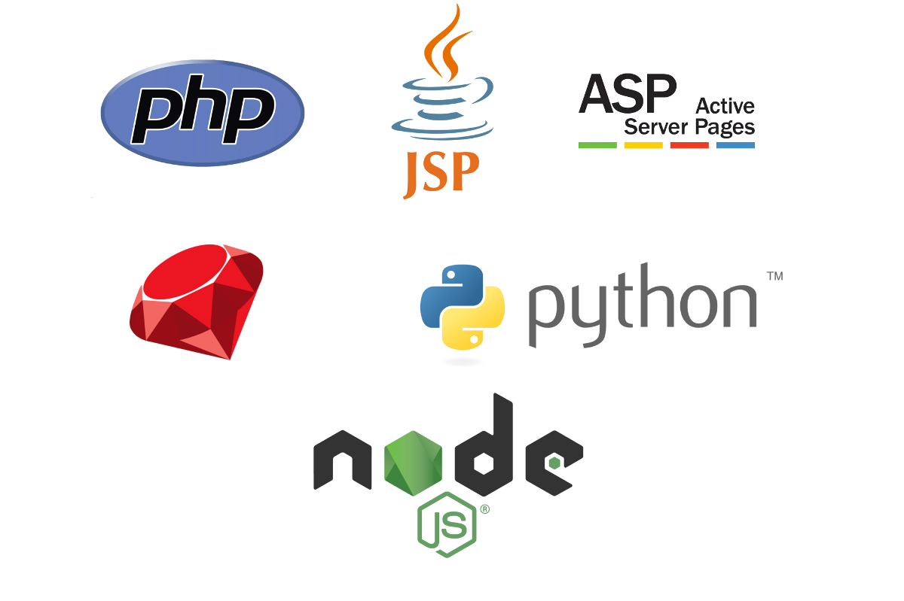
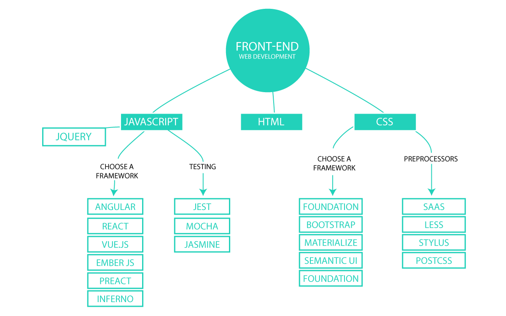
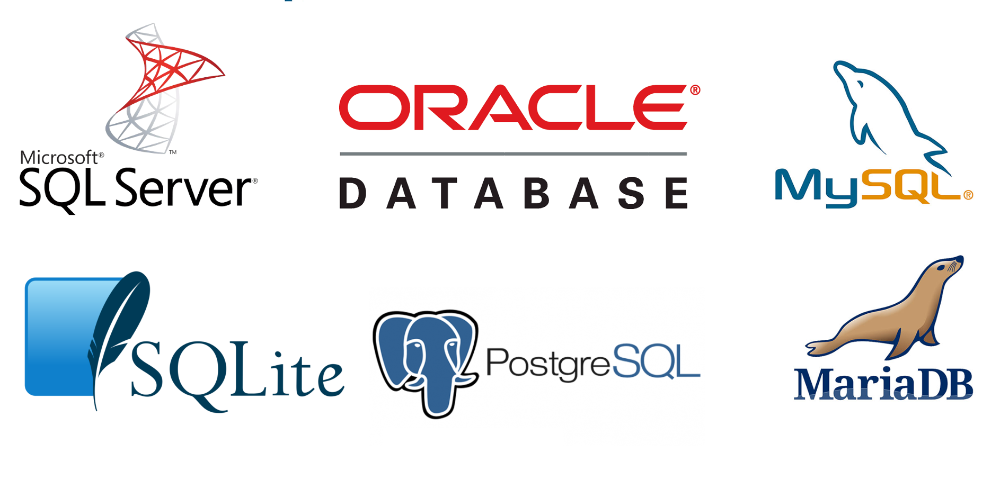

<!---
Ejemplos de inserción de videos

<video class="stretch" controls><source src="http://clips.vorwaerts-gmbh.de/big_buck_bunny.mp4" type="video/mp4"></video>
<iframe width="560" height="315" src="https://www.youtube.com/embed/3RBq-WlL4cU" frameborder="0" allowfullscreen></iframe>

slide: data-background="#ff0000" 
element: class="fragment" data-fragment-index="1"
-->

## HLC - Fullstack
---

<small> 2018-19 - IES Luis Vélez de Guevara - Écija - Spain </small>

## Conceptos generales

## Índice
--- 
### Introducción
### Tecnologías para el backend
### Tecnologías para el frontend
### MVC: Modelo-Vista-Controlador
### SPA: Single Page Application 
### Persistencia de los datos

<!--- Note: Nota a pie de página. -->

## Introducción

### En esta Unidad aprenderemos a

- Identificar las tecnologías base de la web.
- Identfificar los lenguajes y frameworks usados en el lado del servidor.
- Identfificar los lenguajes y frameworks usados en el lado del cliente.
- Reconocer el patrón MVC.
- Distinguir entre MPA y SPA.
- Valorar la importancia de la persistencia de los datos.

### La base de la web

- **HTML**: Estructura del documento. `HTML5`. 
- **CSS**: Formato/apariencia del documento. `CSS3`.
- **Javascript**: Funcionalidad del documento. `ECMAScript6`.

Note: Al final de línea se muestra la versión más relevante actualmente.

### Partes de una aplicación web

### Partes de una aplicación web

- **Backend**: parte que se ejecuta en el servidor.
  - Se encarga de atender las peticiones de los clientes.
  - Suele tener soporte de almacenamiento de datos.
  - También se denomina capa de acceso a datos
- **Frontend**: parte que se ejecuta en el cliente.
  - Se encarga de la experiencia del usuario (UX).
  - Puede tener soporte de cache de datos.
  - También se denomina capa de presentación.

## Tecnologías para el backend

### Lenguajes del lado del servidor

### Lenguajes del lado del servidor

- **PHP**: PHP Hypertext Preprocessor. Uno de los lenguajes más utilizados para la creación de todo tipo de CMS.
- **JSP**: JavaServer Pages. Es la propuesta de Java, y uno de los más demandados.
- **ASP**: Active Server Pages. Es el lenguaje de desarrollo web de Microsoft. 
- **Ruby**: es un lenguaje de programación interpretado, reflexivo y orientado a objetos.
- **Python**: es un lenguaje de programación multiparadigma que hace hincapié en el código legible. 
- **Javascript (Node.js)**: cada vez más popular puesto que usa el mismo lenguaje que en el lado cliente.

### Frameworks del lado servidor 

### Frameworks del lado servidor 

- PHP: **Laravel**, **Symphony**.
- JSP: **Spring**, **Struts**.
- ASP: **ASP.NET**, **ASP.NET Core**.
- Ruby: **Ruby on rails**.
- Python: **Django**.
- Node.js: **Express**. 

Referencia: https://es.wikipedia.org/wiki/Modelo%E2%80%93vista%E2%80%93controlador 

### Resumen

## Tecnologías para el frontend

### Lenguajes del lado del cliente

- **Javascript**: 

### Frameworks del lado cliente 

- **React**
- **Angular**
- **Vue**

### Resumen

## Modelo-Vista-Controlador

## Single Page Application

## MVC vs SPA

## MVC vs SPA

#### MVC

- se ejecuta casi toda la lógica de aplicación en el backend. 
- el servidor sirve múltiples vistas, cada vista es una página HTML. 
- es una aplicación de múltiples páginas (MPA). 

#### SPA

- se ejecuta gran parte de la lógica de la aplicación en el frontend. 
- el servidor sirve datos mediante una API web. 
- principalmente se usan 2 formatos para el intercambio de datos:
  - **XML**
  - **JSON** 

## Persistencia de los datos

- Uso de archivos
- Bases de datos relacionales
  - Subtipo importante: BBDD objeto-relacionales.
- Bases de datos no relacionales
  - Subtipo importante: BBDD noSQL

### Bases de datos relacionales

### Bases de datos relacionales

- SQL Server 
- Oracle
- MySQL
- MariaDB
- PostgreSQL
- SQLite

### Bases de datos no relacionales (noSQL)

### Bases de datos no relacionales (noSQL)

- Cassandra
- MongoDB
- Redis
- CouchDB

