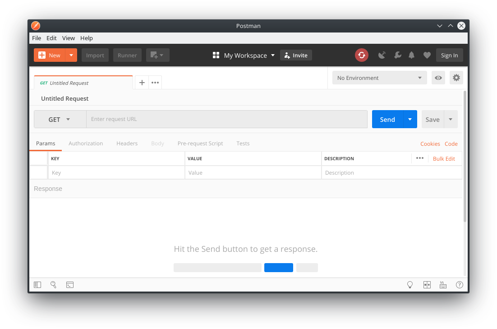
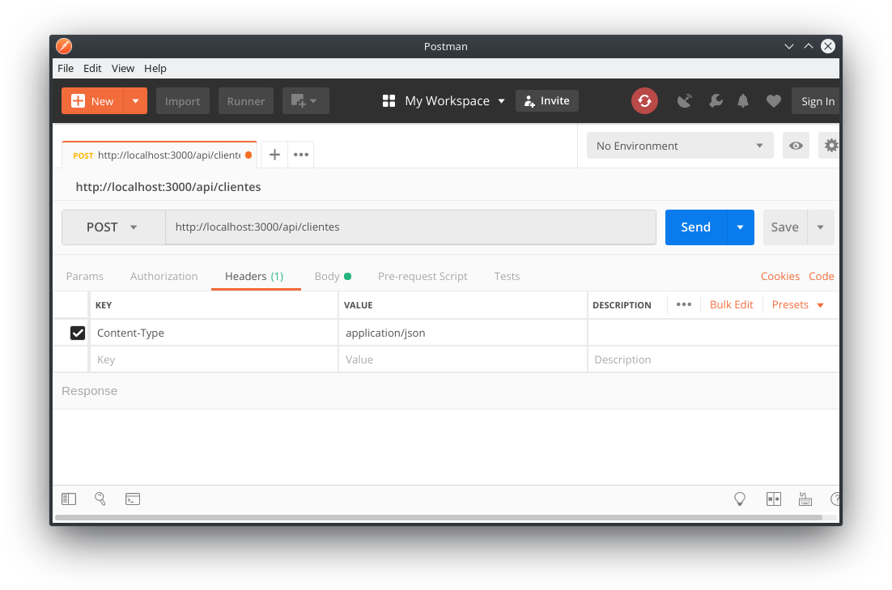
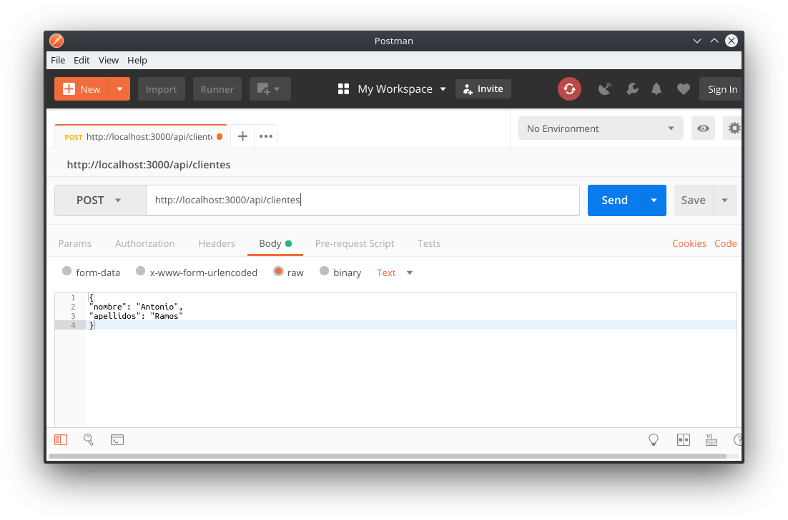
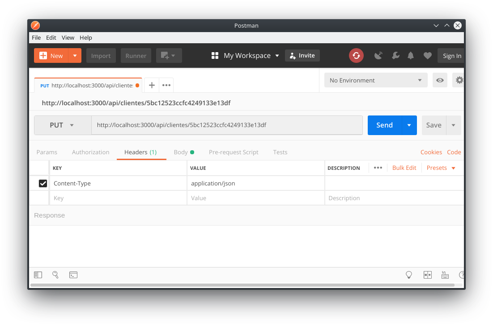
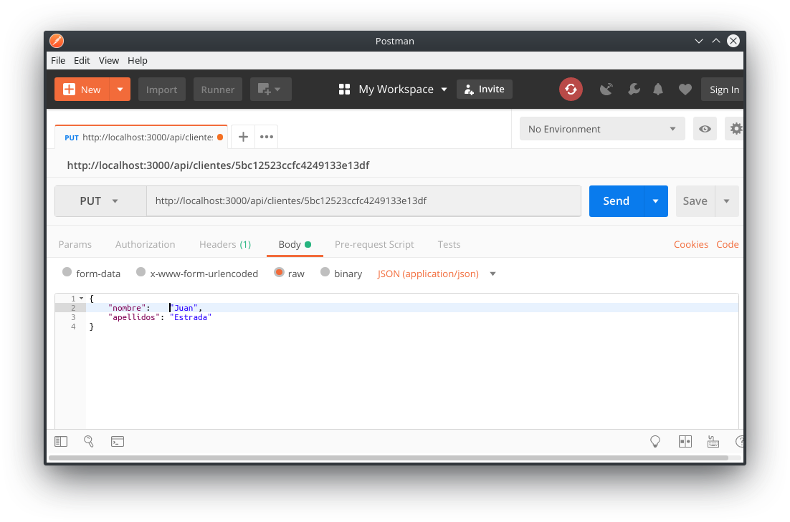

<!---
Ejemplos de inserción de videos

<video class="stretch" controls><source src="http://clips.vorwaerts-gmbh.de/big_buck_bunny.mp4" type="video/mp4"></video>
<iframe width="560" height="315" src="https://www.youtube.com/embed/3RBq-WlL4cU" frameborder="0" allowfullscreen></iframe>

slide: data-background="#ff0000" 
element: class="fragment" data-fragment-index="1"
-->

## HLC - Fullstack
---

<small> 2018-19 - IES Luis Vélez de Guevara - Écija - Spain </small>


## Backend con NodeJS y Express

[](http://creativecommons.org/licenses/by-sa/4.0/)


## Índice
--- 
- ### Introducción
- ### Node.js
- ### El servidor web
- ### Accediendo a la BD
- ### Ajustes finales
- ### Comprobando la API

<!--- Note: Nota a pie de página. -->


## Introducción


### En esta Unidad aprenderemos a

- Instalar y configurar el entorno de desarrollo.
- Gestionar las dependencias mediante el uso del gestor de paquetes.
- Elaborar una API RESTful.
- Hacer peticiones a la API desde distintos clientes.
- Definir el modelo de datos y acceder a la base de datos desde el código de la aplicación.


### Aplicación de ejemplo

- Existe una aplicación funcional de ejemplo.
- El código está disponible en [`https://github.com/jamj2000/tienda0`](https://github.com/jamj2000/tienda0)
- Los archivos usados para el backend son:
  - **package.json**
  - **server.js**
  - **models.js**
  - **routes.js**
  - **config.js**


## Node.js


### Motor Javascript V8


Node.js® es un entorno de ejecución para JavaScript construido con el **motor de JavaScript V8 de Chrome**.


### Instalación

**Entorno de ejecución**

```bash
sudo  apt  install  nodejs
```

**Gestor de paquetes**
```bash
sudo  apt  install  npm
```

Note: **npm** =  **N**ode **P**ackage **M**anager


### Inicio de un proyecto

```bash
mkdir  nombre-proyecto
cd     nombre-proyecto

npm  init  -y 
```

Note: La opción -y (--yes) de `npm init` crea un archivo package.json con opciones por defecto, sin solicitar al usuario.


### Archivo package.json

```json
{
  "name": "hola",
  "version": "1.0.0",
  "description": "",
  "main": "index.js",
  "scripts": {
    "test": "echo \"Error: no test specified\" && exit 1"
  },
  "keywords": [],
  "author": "",
  "license": "ISC",
  "dependencies": {
    "express": "^4.16.4"
  },
  "devDependencies": {
    "nodemon": "^1.18.4"
  }
}
```


### Instalación de módulos

```bash
     npm  install  express  -S  
     npm  install  nodemon  -D  
sudo npm  install  yarn     -g  
```

o de forma más corta

```bash
     npm  i  express  -S  
     npm  i  nodemon  -D  
sudo npm  i  yarn     -g
```

Note: -S: anotar en package.json como dependencia de aplicación.

Note: -D: anotar en package.json como dependencia de desarrollo.

Note: -g: instala en el sistema de forma global.


### Desinstalación de módulos

```bash
     npm  remove  express  -S 
     npm  remove  nodemon  -D 
sudo npm  remove  yarn     -g 
```   
o de forma más corta

```bash
     npm  r  express  -S  
     npm  r  nodemon  -D  
sudo npm  r  yarn     -g
```

Note: -S: anotar en package.json como dependencia de aplicación.

Note: -D: anotar en package.json como dependencia de desarrollo.

Note: -g: instala en el sistema de forma global.


### Módulos incorporados (built-in)

- No es necesario instalarlos.
- Ya vienen con node.js.
- Ejemplos:
  - **fs**:  Sistema de archivos
  - **http**:  Servidor HTTP 
  - **os**:  Sistema operativo
  - **path**:  Rutas de archivos
  - **process**:  Información y control del proceso actual
  - ...

Mas info: https://www.w3schools.com/nodejs/ref_modules.asp


## El servidor web

- Node.js nos permite desarrollar un servidor web desde cero.
- Para ello puede usarse el módulo incorporado `http`.
- Sin embargo es más recomendable, por su sencillez, usar el **framework `express`**.


### Un servidor sencillo

**server1.js**

```javascript
var app  =  require('express')();

app.get ('/', (req, res) => { 
    res.send ('<h1>Hola mundo</h1>') 
});

app.get ('/hola/:usuario', (req, res) => { 
    res.send (`<h1>Buenos días, ${req.params.usuario}</h1>`); 
});

app.listen (3000);
```
Para ejecutar:

```bash
node  server1
```


### Otro servidor sencillo  

**server2.js**

```javascript
// --- IMPORTACIONES
const path     = require('path');
const express  = require('express');
const morgan   = require('morgan');

const app      = express();

// --- MIDDLEWARE
// Archivos estáticos. Deberás crear un archivo public/index.html para ver el resultado
app.use(express.static(path.join(__dirname , 'public')));
// Soporte de JSON
app.use(express.json());
// Logger
app.use(morgan('dev'));

// --- PUERTO DE ESCUCHA
app.listen (3000, () => console.log('Servidor iniciado en puerto 3000'));
```

Para ejecutar:

```bash
node  server2
```


## Accediendo a la BD


### Conexión a la BD

**server.js**

```javascript
const mongoose = require('mongoose');

mongoose.connect('mongodb://localhost:27017/tienda', { useNewUrlParser: true })
  .then(db   => console.log ('Conexión correcta a la BD'))
  .catch(err => console.log ('Error en la conexión a la BD'));
```


### El modelo de datos
**models.js**

```bash
const mongoose = require('mongoose');

const Cliente  = mongoose.model('Cliente',  { 
                                   nombre: String, 
                                   apellidos: String  });

const Articulo = mongoose.model('Articulo', { 
                                   nombre: String, 
                                   precio: Number });

module.exports =  {
    Cliente,
    Articulo
};
```


### Operaciones CRUD

| CRUD     |  HTTP    | MongoDB   | Mongoose                     |
|----------|----------|-----------|------------------------------|
| Create   | POST     | insert    | objeto.save                  |
| Read     | GET      | find      | Modelo.find / Modelo.findOne |
| Update   | PUT      | update    | Modelo.findOneAndUpdate      |
| Delete   | DELETE   | remove    | Modelo.findOneAndRemove      |


### Acceso a la BD (I)
**routes.js**
#### Importación de módulos

```javascript
const express = require('express');
const { Cliente, Articulo } = require('./models');

const router = express.Router();
```


### Acceso a la BD (II)
**routes.js**
#### Lectura de datos

```javascript
// ver todos los Clientes
router.get('/clientes', (req, res) => {  
  Cliente.find( ... ver más abajo ... );  
});
```

```javascript
    Cliente.find({}, (err, data) => {
        if (err) res.json({ error: err });
        else     res.json(data);
    });
```


### Acceso a la BD (III)
**routes.js**
#### Lectura de datos

```javascript
// ver un Cliente
router.get('/clientes/:id', (req, res) => {  
  Cliente.findOne( ... ver más abajo ... ); 
});
```

```javascript
    Cliente.findOne({ _id: req.params.id }, (err, data) => {
        if (err) res.json({ error: err });
        else     res.json(data);
    });
```


### Acceso a la BD (IV)
**routes.js**
#### Eliminación de datos

```javascript
// eliminar un Cliente
router.delete('/clientes/:id', (req, res) => { 
  Cliente.findOneAndRemove( ... ver más abajo ... ); 
});
```

```javascript
    Cliente.findOneAndRemove({ _id: req.params.id }, (err, data) => {
        if (err) res.json({ error: err });
        else     res.json(data);
    });
```


### Acceso a la BD (V)
**routes.js**
#### Modificación de datos

```javascript
// actualizar un Cliente
router.put('/clientes/:id', (req, res) => {
  Cliente.findOneAndUpdate( ... ver más abajo ... ); 
});
```

```javascript
    Cliente.findOneAndUpdate (
      { _id: req.params.id }, 
      { $set: { nombre: req.body.nombre, apellidos: req.body.apellidos } }, 
      (err, data) => {
        if (err) res.json({ error: err });
        else     res.json(data);
    });
```


### Acceso a la BD (VI)
**routes.js**
#### Inserción de datos

```javascript
// insertar un Cliente
router.post('/clientes', (req, res) => {
    const cliente = new Cliente({ 
                          nombre: req.body.nombre, 
                          apellidos: req.body.apellidos });
    cliente.save( ... ver más abajo ... );
});
``` 

```javascript
    cliente.save((err, data) => {
        if (err) res.json({ error: err });
        else     res.json(data);
    });
```


## Ajustes finales


### Estableciendo las rutas 

**server.js**

```javascript
const routes = require('./routes');

// Rutas
app.use ('/api', routes);
```


### Parámetros de configuración

- Para facilitar el mantenimiento y despliegue de la aplicación, situamos todos los parámetros de configuración en el archivo **`config.js`**

```javascript
// El primer valor es el de PRODUCCIÓN. El valor alternativo es el de DESARROLLO

module.exports = {
  ip         : process.env.HOST   || '0.0.0.0',
  port       : process.env.PORT   || 3000,
  db_uri     : process.env.DB_URI || 'mongodb://localhost:27017/tienda'
};
```


### Uso de parámetros

- En el archivo **`server.js`** utilizamos las variables anteriores en lugar de constantes.
- Si importamos el objeto como config, entonces tenemos:
  - `config.port`
  - `config.db_uri`

```javascript
const config = require('./config');

mongoose.connect(config.db_uri, { useNewUrlParser: true })
  .then(db   => console.log ('Conexión correcta a la BD'))
  .catch(err => console.log ('Error en la conexión a la BD'));

app.listen (config.port, 
            () => console.log(`Servidor iniciado en puerto ${config.port}`));
```


## Comprobando la API

- Para hacer consultas a la API RESTful usaremos 3 métodos:
  - **curl**
  - **DevTools del navegador**
  - **Postman**


### curl (I)

Aplicación que nos permite realizar peticiones HTTP de tipo **POST**, **GET**, **PUT**, **DELETE**, y muchas otras, de forma directa desde **terminal de texto**.


### curl (II)

```bash
# GET
curl  http://localhost:3000/api/articulos
curl -H 'Content-Type: application/json' \
     -X GET http://localhost:3000/api/articulos

# POST
curl -H 'Content-Type: application/json' \
     -X POST -d '{"nombre": "Botas de invierno","precio": 99.99}' \
     http://localhost:3000/api/articulos

# PUT
curl -H 'Content-Type: application/json' \
     -X PUT -d '{"nombre": "Paraguas","precio": 100.20}' \
     http://localhost:3000/api/articulos/5b609c52c60bd6656205e3d7

# DELETE
curl -H 'Content-Type: application/json' \
     -X DELETE http://localhost:3000/api/articulos/5b609c52c60bd6656205e3d7
```


### DevTools del navegador (I)

Mediante código javascript podemos realizar peticiones HTTP de tipo **POST**, **GET**, **PUT**, **DELETE**, y alguna otra. Si el servidor no tiene habilitado `CORS`, deberemos tener abierta en el navegador alguna página del dominio para realizar peticiones desde el mismo origen.


### DevTools del navegador (II)

```javascript
fetch('/api/clientes', { method: 'GET' })
  .then ( res => res.json())
  .then ( data => console.log(data) );

fetch('/api/clientes/5b4916cb2100bc25330b6ac9', { method: 'GET' })
  .then ( res => res.json())
  .then ( data => console.log(data) );

fetch('/api/clientes/5b49b5e33808be1b00b982e2', { method: 'DELETE' })
  .then ( res => res.json())
  .then ( data => console.log(data) );
```


### DevTools del navegador (III)

```javascript
var cliente = { nombre: "Isabel", apellidos: "López" };

fetch('/api/clientes', {
  method: 'POST',
  body: JSON.stringify(cliente), 
  headers:{
    'Content-Type': 'application/json'
  }
})
  .then(res => res.json())
  .then(data => console.log(data))
```


### DevTools del navegador (III)

```javascript
var cliente = { nombre: "Pepe", apellidos: "Pérez" };

fetch('/api/clientes/5b4916cb2100bc25330b6ac9', {
  method: 'PUT',
  body: JSON.stringify(cliente), 
  headers:{
    'Content-Type': 'application/json'
  }
})
  .then(res => res.json())
  .then(data => console.log(data));
```


### Postman

Aplicación que nos permite realizar peticiones HTTP de tipo **POST**, **GET**, **PUT**, **DELETE**, y muchas otras, de forma sencilla, cómoda y gráfica.


### Postman: Instalación

- Descargar de la página oficial: https://www.getpostman.com/apps
- Descomprimir
- Ejecutar `Postman/Postman`


###  Postman: Ejecución




###  Postman: POST Header




###  Postman: POST Body




###  Postman: PUT Header




###  Postman: PUT Body


